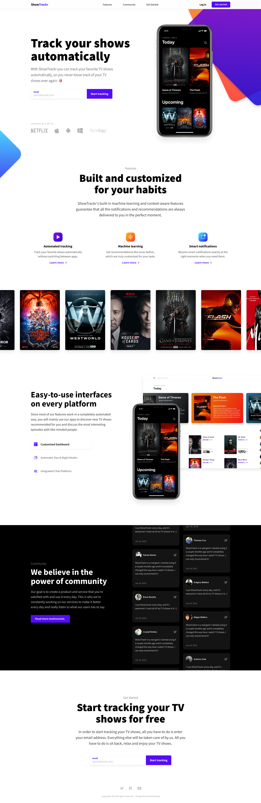
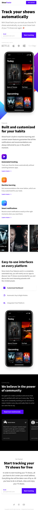
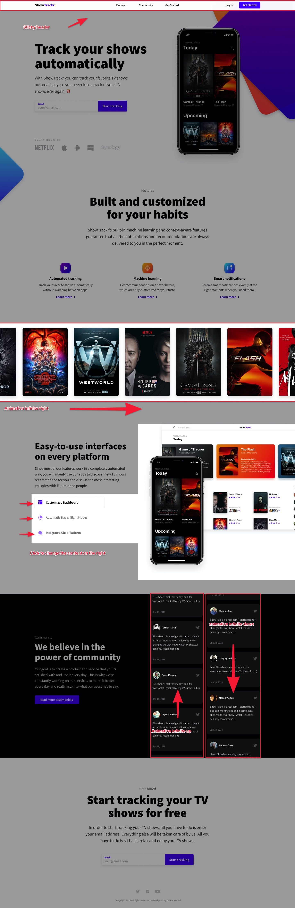

# Altar: gig-sass-public **[DO NOT FORK]**

## STEPS

1. **Clone** the project to your GitHub account **[DO NOT FORK]**
2. Create a branch with your name (ex: andre-pinto)
3. Develop under that branch
4. Run `gulp build` at the end
5. Submit a **Pull Request** on your **Repo**
6. Send us an email with your **Repo**

&nbsp;

## INSTALLATION

1. Open **Terminal** if you are on macOS or **CMD** if on Windows
2. Open the project folder (`cd project/`)
3. Run `npm install` --> install local dependencies from **package.json**
4. Run `npm install gulp` --> install local gulp dependency

&nbsp;

## DEVELOP

1. Run `gulp watch` --> (runs the project in dev mode, starts a local server and opens the window on the local server endpoint)
2. Run `gulp build` --> (generate build)

&nbsp;

---

&nbsp;

### REQUIREMENTS

Font sizes, colors, etc, don't have to be the exactly the same. We give more value to those who **DON'T** any library to produce the result. Anything can be done using only with HTML and Sass but if you have to use Javascript fell free to use the file on `src/assets/js/main.js`. All images are provided in `src/assets/images/` folder. Amaze us with your awesome code :D

&nbsp;

### FINISH

When you finish you should run `gulp build` to generate all files into the `docs/` folder.

&nbsp;

### TECH

The source files (editable) are located in the `src/` folder.
To ensure the integrity of the project you should only edit these files inside this folder.
The gulp scripts are able to handle with preprocessing (html, sass, etc...)

&nbsp;

### OUTPUT

The output should be a responsive version of these next images.

---

&nbsp;

#### Desktop image (property of [Daniel Korpai](https://danielkorpai.com/))

&nbsp;

---

&nbsp;

#### Mobile image (property of [Daniel Korpai](https://danielkorpai.com/))

&nbsp;

---

&nbsp;

#### Desktop image with notes (property of [Daniel Korpai](https://danielkorpai.com/))

